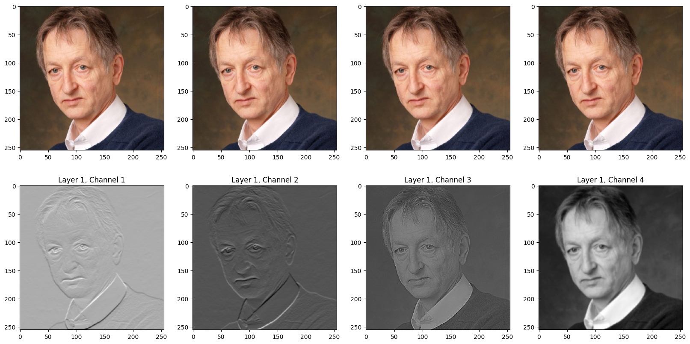
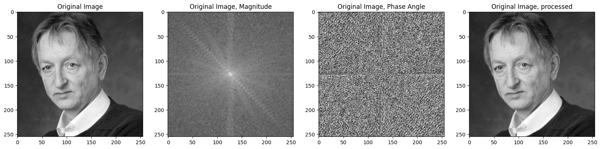
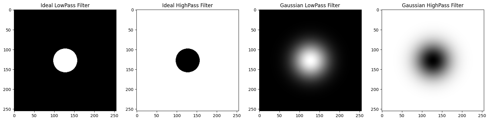

<!-- About the Project -->
## About

* [Q2.ipynb](Q2.ipynb)  
   - Implemented `2D convolution` and `2D max pooling` functions using only numpy.  
   - Invoked functions on a simple image using the given kernels.
* [Q3.ipynb](Q3.ipynb)  
   - Transformed images into frequency domain using `2D DFT` and `2D FFT`.  
   - Implemented low-pass and high-pass filters and Applied them to the images.

### Functions

```python
def Conv2D(img, filters, stride=1, padding='same'):
    .
    .
    .
    return output_image
```

| Parameters | Type         | Detail                    |
| ---------- | ------------ | ------------------------- |
| img        | `np.ndarray` | height * width * channels |
| filters    | `np.ndarray` | f * f * number_of_filters |
| stride     | `Integer`    | `1` by deafult            |
| padding    | `String`     | `"same"` or `"valid"`     |

```python
def MaxPooling2D(img, window=(2, 2), stride=2):
    .
    .
    .
    return output_image
```

| Parameters | Type         | Detail                    |
| ---------- | ------------ | ------------------------- |
| img        | `np.ndarray` | height * width * channels |
| window     | `Tuple`      | `(height, width)`         |
| stride     | `Integer`    | `2` by deafult            |

### Results

* [Q2.ipynb](Q2.ipynb)  
   - Convolution:  
   
* [Q3.ipynb](Q3.ipynb)
    - DFT & FFT:  
        
    - Low-pass & High-pass filters:  
      